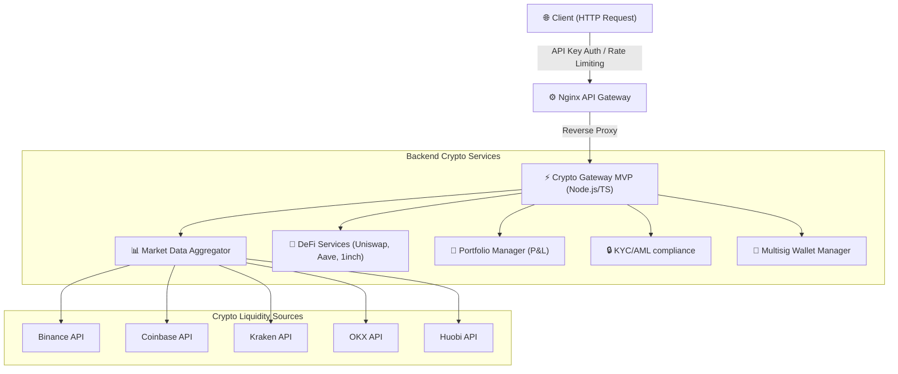

# Crypto Gateway MVP

A high-performance, production-ready Node.js and TypeScript microservice for institutional cryptocurrency transactions, market data aggregation, compliance checking, and multi-signature operations. 

This service is designed to sit behind the **Nginx DMMR API Gateway** (Kong alternative) as an upstream backend.

---

## 🏛️ System Architecture



---

## 📂 Project Structure

The project has been structured according to institutional standards:

```text
src/
├── types.ts                   # Core interfaces and 50 supported cryptos
├── index.ts                   # Express server entry point with API routing
├── exchanges/                 # Exchange integration adapters
│   ├── base.ts                # Abstract class with automatic simulation fallbacks
│   ├── binance.ts             # Binance API client
│   ├── coinbase.ts            # Coinbase API client
│   ├── kraken.ts              # Kraken API client
│   ├── okx.ts                 # OKX API client
│   └── huobi.ts               # Huobi API client
├── defi/                      # Decentralized Finance wrappers
│   ├── uniswap.ts             # Uniswap V3/V4 pool quotes & slippage calculation
│   ├── aave.ts                # Aave supply/borrow APY & health factors
│   └── 1inch.ts               # 1inch route optimization & protocol splits
├── market-data/               # Aggregation algorithms
│   └── aggregator.ts          # Consolidation of tickers and order books
├── portfolio/                 # Balance & valuation service
│   └── manager.ts             # Asset value tracking and P&L monitoring
├── kyc-aml/                   # Compliance and anti-money laundering screening
│   └── service.ts             # Document checks, OFAC lists, and risk scores
└── wallet/                    # Security components
    └── multisig.ts            # M-of-N multi-sig transaction proposal & signature flows
```

---

## ✨ Features

### 1. Multi-Exchange Aggregator
- **50 Cryptocurrencies Supported**: BTC, ETH, USDT, SOL, XRP, BNB, ADA, DOGE, and many more.
- **5 Major Integrations**: Real-time ticker price aggregation and consolidated order book depth across Binance, Coinbase, Kraken, OKX, and Huobi.
- **Resilient Fallback**: Automatic mock generator switches in seamlessly if APIs fail or are offline, ensuring uptime.

### 2. DeFi Hub
- **Uniswap V3/V4**: Exact-input swap quotes, pool status lookup, and slippage metrics.
- **Aave Protocol**: Supply/borrow APY percentages and automatic Loan-to-Value (LTV) health factors.
- **1inch Routing**: Aggregation routes splits across protocols (e.g. Uniswap + Curve).

### 3. Portfolio & P&L Tracker
- Institutional wallet value calculations in USD.
- Real-time updates and average buy cost basis calculations.
- Detailed unrealized profit/loss statements (value and percentage).

### 4. KYC / AML Compliance
- Registration screen with automatic sanction list matches (OFAC/PEP checks).
- Real-time transaction amount monitoring for high-value alerts (above $50,000 USD).

### 5. Multi-Sig Vaults
- M-of-N signature collection for transactions.
- Security-guarded withdrawal execution once signature threshold is reached.

---

## 🚀 How to Run

### Requirements
- Node.js (v20+ recommended, v26.4.0 verified)
- npm or yarn

### Installation
1. Clone this repository.
2. Install the dependencies:
   ```bash
   npm install
   ```

### Running in Development
Start the service using `ts-node-dev` with live reload:
```bash
npm run dev
```
The service will start on port `3000` (default) or the port configured via the `PORT` environment variable.

### Building for Production
Compile the TypeScript code:
```bash
npm run build
```
Start the compiled production bundle:
```bash
npm start
```

---

## 📡 API Endpoints

### Health Check
- `GET /api/health` - Check service status.

### Market Data
- `GET /api/market-data/price/:symbol` - Retrieve consolidated market price and individual exchange prices.
- `GET /api/market-data/orderbook/:symbol` - Retrieve a consolidated order book (top 10 bids/asks).

### DeFi
- `GET /api/defi/uniswap/quote?tokenIn=BTC&tokenOut=USDT&amountIn=1.0` - Quote a token swap.
- `GET /api/defi/aave/reserve/:symbol` - Retrieve supply/borrow APYs.
- `GET /api/defi/1inch/quote?fromToken=ETH&toToken=USDT&amount=10` - Retrieve optimal route mapping.

### Portfolio
- `GET /api/portfolio/:id` - Retrieve detailed asset allocation and P&L.

### KYC / AML Compliance
- `GET /api/kyc/status/:id` - Retrieve a user's compliance record.
- `POST /api/kyc/register` - Submit a user document for verification.
  - Body: `{ "fullName": "Jane Doe", "documentNumber": "123.456.789-00", "documentType": "CPF" }`

### Multi-Sig Wallets
- `GET /api/multisig/wallet/:address` - View wallet balance and owners.
- `POST /api/multisig/propose` - Propose a multi-sig asset transfer.
  - Body: `{ "walletAddress": "0xAddress", "toAddress": "0xTo", "symbol": "BTC", "amount": 1.5, "creatorAddress": "0xOwner" }`
- `POST /api/multisig/sign` - Append signature to a transaction proposal.
  - Body: `{ "proposalId": "prop-id", "signerAddress": "0xOwner2" }`

---

## ⚙️ Nginx Reverse Proxy Configuration

To expose this service behind Nginx, add the following location block to your server configuration:

```nginx
server {
    listen 80;
    server_name mycrypto.gateway;

    # Backend API Proxy
    location /api/ {
        proxy_pass http://127.0.0.1:3000;
        proxy_http_version 1.1;
        proxy_set_header Upgrade $http_upgrade;
        proxy_set_header Connection 'upgrade';
        proxy_set_header Host $host;
        proxy_cache_bypass $http_upgrade;
        
        # Native DMMR Module directives can be applied here
        # dmmr_enable on;
        # dmmr_rate_limit 120;
    }
}
```
