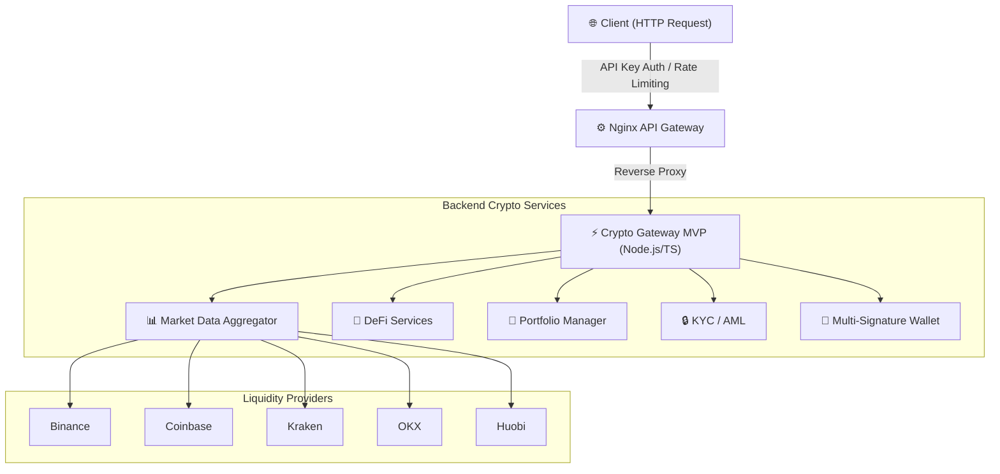

# Crypto Gateway MVP

A modular Node.js and TypeScript microservice demonstrating an institutional-grade architecture for cryptocurrency transactions, market data aggregation, compliance workflows, and multi-signature operations.

The project was designed as an extensible MVP that demonstrates architectural decisions commonly found in enterprise financial platforms while remaining easy to evolve into a production environment.

This service is designed to sit behind the **Nginx DMMR API Gateway** as an upstream backend.

---

# 🏛️ System Architecture



---

# 🎯 Project Goals

The project demonstrates how an institutional crypto gateway can be organized using modern backend architecture principles.

Key objectives include:

- Multi-exchange market aggregation.
- Modular DeFi integrations.
- Portfolio management.
- Compliance (KYC / AML) workflow.
- Multi-signature transaction management.
- Clean separation between infrastructure and business logic.
- Extensible architecture for future integrations.

---

# 🧩 Design Decisions

The project adopts several architectural patterns intended to maximize maintainability and extensibility.

- Adapter Pattern for exchange integrations.
- Service-oriented architecture.
- Strong typing with TypeScript.
- Clear separation of responsibilities.
- Fault-tolerant provider abstraction.
- Easily extensible modules.
- Backend completely independent from the API Gateway implementation.

---

# 📂 Project Structure

```text
src/
├── types.ts
├── index.ts
├── exchanges/
│   ├── base.ts
│   ├── binance.ts
│   ├── coinbase.ts
│   ├── kraken.ts
│   ├── okx.ts
│   └── huobi.ts
├── defi/
│   ├── uniswap.ts
│   ├── aave.ts
│   └── 1inch.ts
├── market-data/
│   └── aggregator.ts
├── portfolio/
│   └── manager.ts
├── kyc-aml/
│   └── service.ts
└── wallet/
    └── multisig.ts
```

---

# ✨ Features

## Market Data Aggregator

- Aggregates prices from multiple exchanges.
- Consolidates order books.
- Supports more than 50 cryptocurrencies.
- Automatic provider fallback when an exchange is unavailable.

---

## DeFi Services

- Uniswap quote simulation.
- Aave reserve information.
- 1inch routing abstraction.

The module was designed to simplify the addition of new DeFi protocols with minimal impact on the remaining services.

---

## Portfolio Management

- Wallet valuation.
- Average acquisition cost.
- Unrealized P&L.
- Asset allocation.

---

## KYC / AML

The project includes a compliance workflow abstraction demonstrating:

- Customer registration.
- Risk scoring.
- Sanction list verification workflow.
- High-value transaction alerts.

The implementation is structured to allow future integration with external compliance providers.

---

## Multi-Signature Wallet

- Proposal creation.
- Signature collection.
- Approval threshold validation.
- Transaction execution workflow.

The module demonstrates the orchestration logic for multi-signature operations.

---

# 🚀 Running

## Requirements

- Node.js 20+
- npm

## Installation

```bash
npm install
```

## Development

```bash
npm run dev
```

## Production Build

```bash
npm run build
npm start
```

---

# 📡 REST API

## Health

```
GET /api/health
```

---

## Market Data

```
GET /api/market-data/price/:symbol
GET /api/market-data/orderbook/:symbol
```

---

## DeFi

```
GET /api/defi/uniswap/quote
GET /api/defi/aave/reserve/:symbol
GET /api/defi/1inch/quote
```

---

## Portfolio

```
GET /api/portfolio/:id
```

---

## KYC

```
GET  /api/kyc/status/:id
POST /api/kyc/register
```

---

## MultiSig

```
GET  /api/multisig/wallet/:address
POST /api/multisig/propose
POST /api/multisig/sign
```

---

# ⚙️ Nginx Integration

Example reverse proxy configuration.

```nginx
server {

    listen 80;

    server_name mycrypto.gateway;

    location /api/ {

        proxy_pass http://127.0.0.1:3000;

        proxy_http_version 1.1;

        proxy_set_header Upgrade $http_upgrade;

        proxy_set_header Connection "upgrade";

        proxy_set_header Host $host;

        proxy_cache_bypass $http_upgrade;

        #
        # Optional DMMR Gateway directives
        #

        # dmmr_enable on;
        # dmmr_rate_limit 120;
    }

}
```

---

# 🛣️ Roadmap

Planned improvements include:

- OAuth2 / JWT authentication.
- OpenTelemetry instrumentation.
- Prometheus metrics.
- Distributed tracing.
- Redis caching.
- Message broker integration (Kafka / RabbitMQ).
- Database persistence.
- CI/CD pipeline.
- Automated integration tests.
- Container orchestration with Kubernetes.
- Secrets management.
- Horizontal scaling strategies.
- Enhanced observability dashboards.

---

# 📖 Notes

This repository is intended as an architectural MVP demonstrating the design of a modular cryptocurrency gateway.

The implementation prioritizes clean architecture, modularity, and extensibility, providing a solid foundation for future production-oriented evolution.